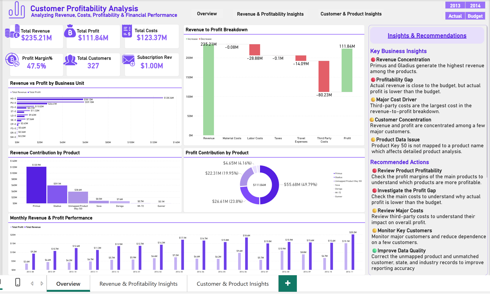
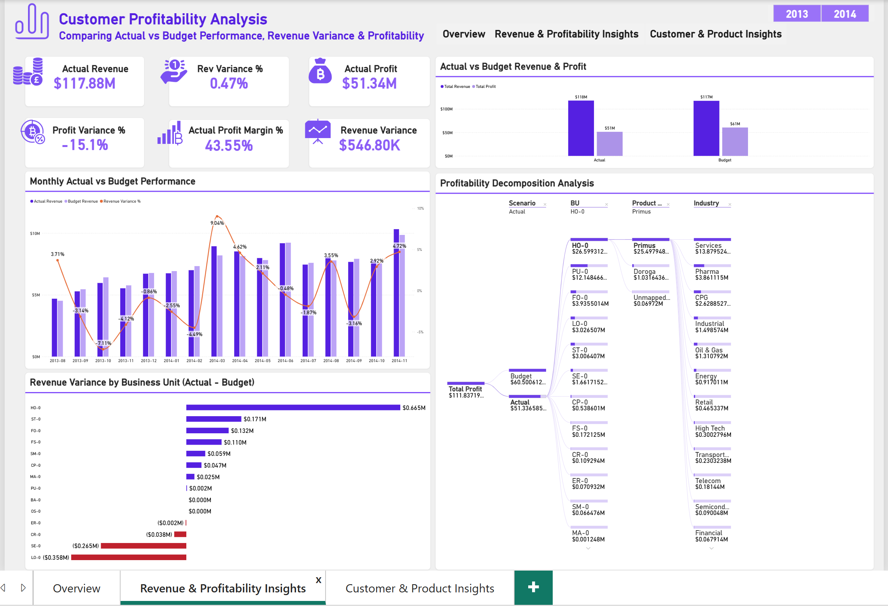
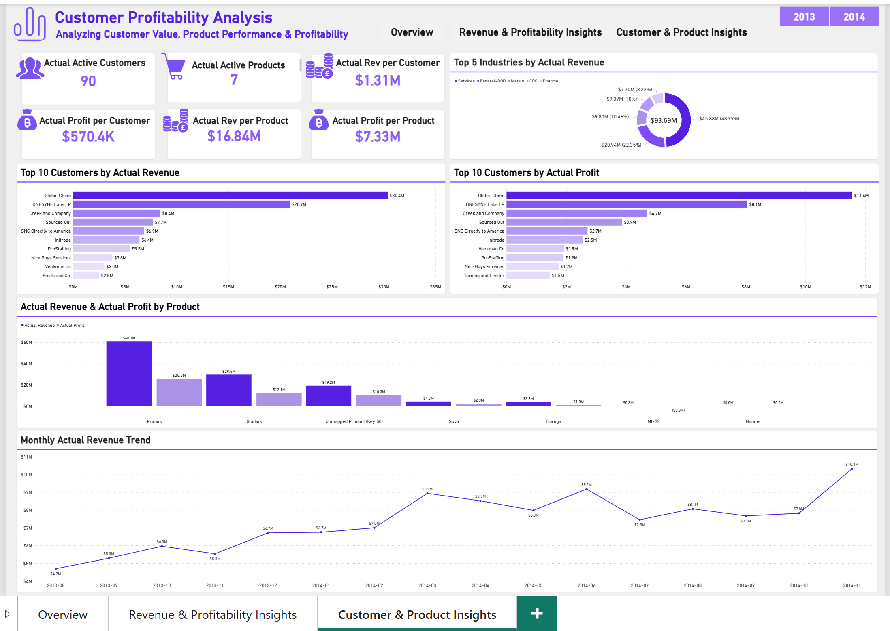

# Customer Profitability Analysis | Power BI

## 📊 Project Overview

The **Customer Profitability Analysis Dashboard** is an interactive Power BI project designed to analyze business performance across revenue, costs, profitability, customers, products, and industries.

The dashboard provides insights into actual financial performance, revenue and profit contributions, customer concentration, and differences between actual and budget performance.

This project demonstrates the application of data preparation, data modeling, DAX measures, and interactive data visualization to support business-oriented analysis.

---

## 🎯 Business Objectives

* Analyze revenue, costs, and profitability across business units and products.
* Compare actual revenue and profit against budget performance.
* Identify major revenue-generating customers and products.
* Analyze customer and product profitability.
* Investigate cost categories contributing to the difference between revenue and profit.
* Identify data-quality issues that may affect reporting accuracy.

---

## 🛠️ Tools & Technologies

* **Microsoft Power BI Desktop**
* **Power Query** — Data preparation and transformation
* **DAX** — Measures and business calculations
* **Data Modeling** — Relationships and dimensional modeling
* **Data Visualization** — Interactive charts, KPIs, and dashboards
* **Microsoft Excel** — Source data

---

## 📁 Dashboard Pages

### 1. Overview

Provides a high-level summary of business performance.

**Key Components:**

* Total Revenue
* Total Profit
* Total Costs
* Profit Margin %
* Total Customers
* Subscription Revenue
* Revenue and Profit by Business Unit
* Revenue to Profit Breakdown
* Revenue Contribution by Product
* Profit Contribution by Product
* Monthly Revenue and Profit Performance
* Business Insights and Recommendations

### 2. Revenue & Profitability Insights

Focuses on actual versus budget performance and profitability analysis.

**Key Components:**

* Actual Revenue
* Revenue Variance %
* Actual Profit
* Profit Variance %
* Actual Profit Margin %
* Actual vs Budget Revenue & Profit
* Monthly Actual vs Budget Performance
* Revenue Variance by Business Unit
* Profitability Decomposition Analysis

### 3. Customer & Product Insights

Analyzes customer value, product performance, and industry-level revenue.

**Key Components:**

* Actual Active Customers
* Actual Active Products
* Actual Revenue per Customer
* Actual Profit per Customer
* Actual Revenue per Product
* Actual Profit per Product
* Top Customers by Revenue
* Top Customers by Profit
* Revenue by Industry
* Actual Revenue and Profit by Product
* Monthly Actual Revenue Trend

---

## 🔄 Data Preparation & Modeling

The dataset was investigated and prepared using Power Query and Power BI data modeling features.

### Data Preparation

* Investigated data structure and table relationships.
* Performed data profiling and reviewed distinct values.
* Investigated null values and data-quality inconsistencies.
* Checked key matching across fact and dimension tables.
* Reviewed revenue and cost-related fields.
* Created a calendar table for time-based analysis.

### Data Modeling

* Established relationships between fact and dimension tables.
* Investigated key mismatches across related tables.
* Used dimensional relationships to support reporting.
* Reviewed relationship structure and filtering behavior.

The model includes a combination of fact and dimension tables. Due to data-structure limitations, some relationships form a snowflake-style model rather than a fully normalized star schema.

---

## 📈 Key Business Insights

The dashboard highlights several areas for business investigation:

### Revenue & Customer Concentration

Revenue is concentrated among selected products and customers, which can support further investigation into customer dependency and revenue diversification.

### Profitability Performance

The report compares actual and budget performance to identify differences in revenue and profit and areas requiring additional investigation.

### Cost Analysis

The revenue-to-profit breakdown helps identify major cost categories and their contribution to overall profitability.

### Product Performance

Revenue and profit contributions vary across products, supporting further analysis of product-level profitability.

> These insights are descriptive findings from the dataset and should be evaluated alongside business context before making decisions.

---

## ⚠️ Data Quality & Limitations

During the data investigation, several data-quality issues were identified:

* Unmatched customer keys between fact and customer dimension data.
* An unmatched product key.
* State values that did not match the corresponding state dimension.
* An industry ID that was not found in the industry dimension.
* An unmapped product record affecting product-level analysis.

These issues were documented as part of the data investigation process and should be considered when interpreting detailed reporting results.

---

## 📌 Skills Demonstrated

* Data Cleaning & Transformation
* Exploratory Data Analysis
* Data Modeling
* DAX Measures
* KPI Development
* Revenue & Profitability Analysis
* Variance Analysis
* Customer Segmentation
* Data Visualization
* Business Insight Communication

---

## 📷 Project Preview

### Overview

### Revenue & Profitability Insights

### Customer & Product Insights

---

## 👤 Author

**Zain Rehman**

Aspiring Data Analyst | Power BI | SQL | Data Analytics
