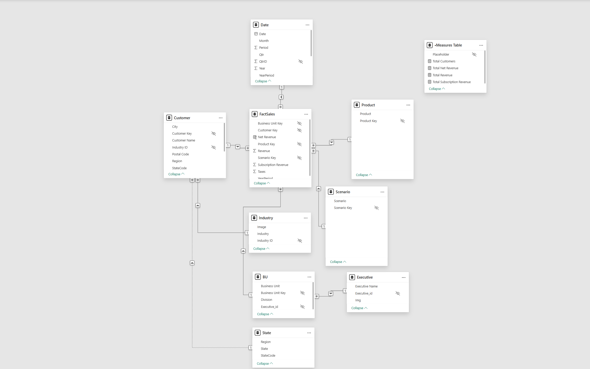
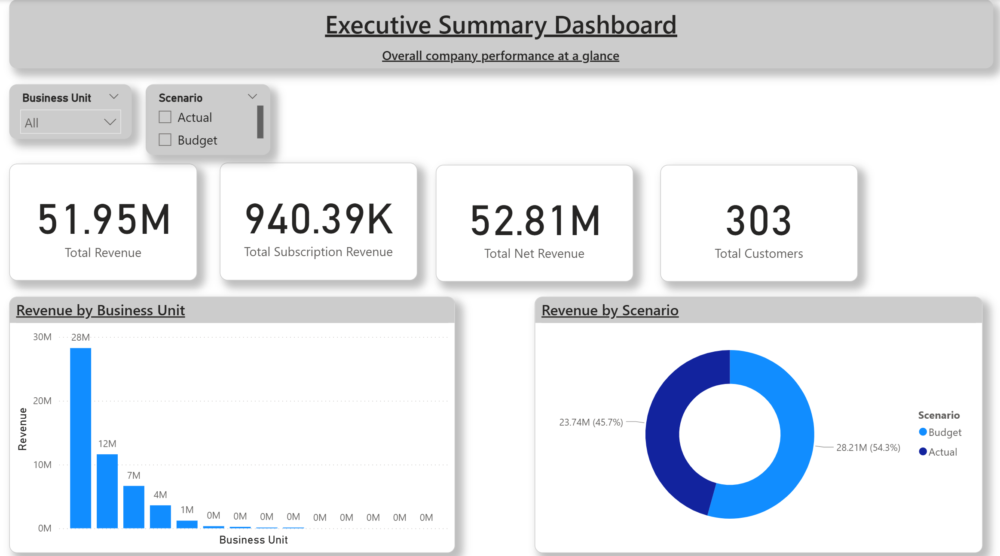
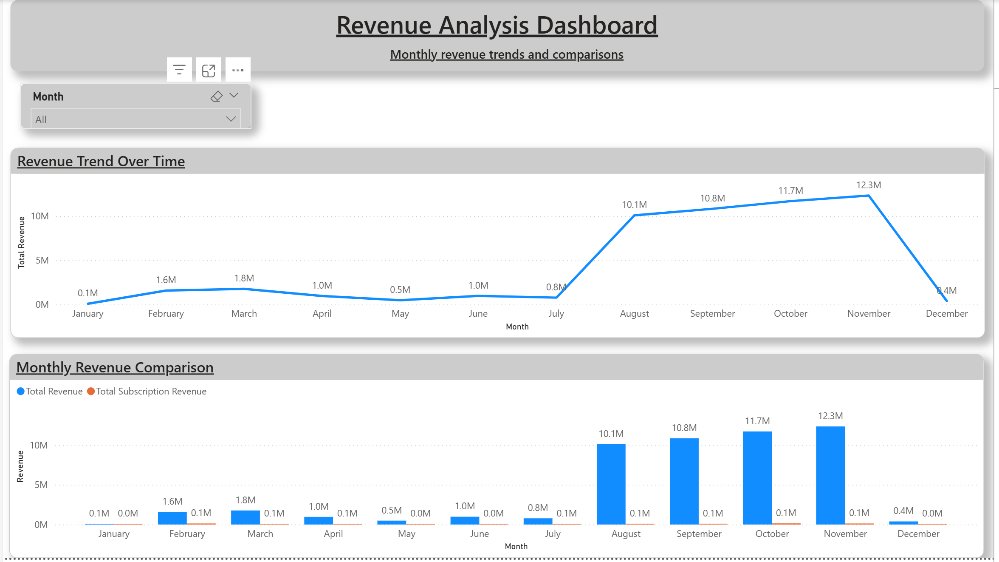
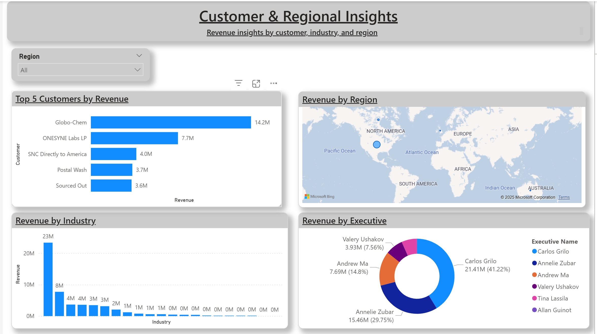

# 📊 Customer Profitability Report — Power BI

## 🎯 Objective
Analyze customer profitability to identify key revenue drivers, high-value customers, and performance across industries, regions, and time.

This report demonstrates end-to-end Power BI skills — from data preparation and modeling to DAX calculations and insight-driven dashboard design.

---

## 🧩 Data Preparation & Modeling
- Imported data from Excel using **Power BI Desktop**
- Cleaned and transformed data in **Power Query**
  - Fixed data types
  - Removed unnecessary columns
  - Handled missing values
- Built a **Star Schema** with:
  - Fact table (Sales)
  - Dimension tables (Customer, Product, Industry, Geography, Date)
- Created a dedicated **Measures Table** to store all KPIs
- Validated relationships using one-to-many cardinality

### ⭐ Data Model (Star Schema)

---

## 📄 Report Pages Overview

---

### 1️⃣ Executive Summary
**Purpose:**  
Provide a high-level snapshot of overall business performance.

**Key Insights:**
- Total Revenue
- Net Revenue
- Total Customers
- Revenue distribution across business units
- Quick comparison of performance by region and industry

---

### 2️⃣ Revenue Analysis
**Purpose:**  
Deep dive into revenue trends and profitability drivers.

**Analysis Includes:**
- Revenue by product category and sub-category
- Industry-wise and region-wise revenue contribution
- Trend analysis over time
- Top-N analysis to identify best-performing segments

---

### 3️⃣ Customer Insights
**Purpose:**  
Understand customer behavior and identify high-value customers.

**Analysis Includes:**
- Customer segmentation by revenue contribution
- Profitability comparison across customer groups
- Insights into repeat vs high-value customers
- Drill-downs for detailed customer-level analysis

---

## 🛠️ Tools & Skills Used
- **Power BI Desktop**
- **Power Query (ETL)**
- **Data Modeling (Star Schema)**
- **DAX Measures**
- **KPI Design**
- **Drill-downs & Interactive Filtering**
- **Dashboard Design & Storytelling**

---

## ✅ Outcome
Delivered a structured, insight-focused Power BI report that highlights profitability drivers, customer value, and revenue trends — demonstrating practical skills required for a **Junior Data Analyst / Power BI Developer** role.

