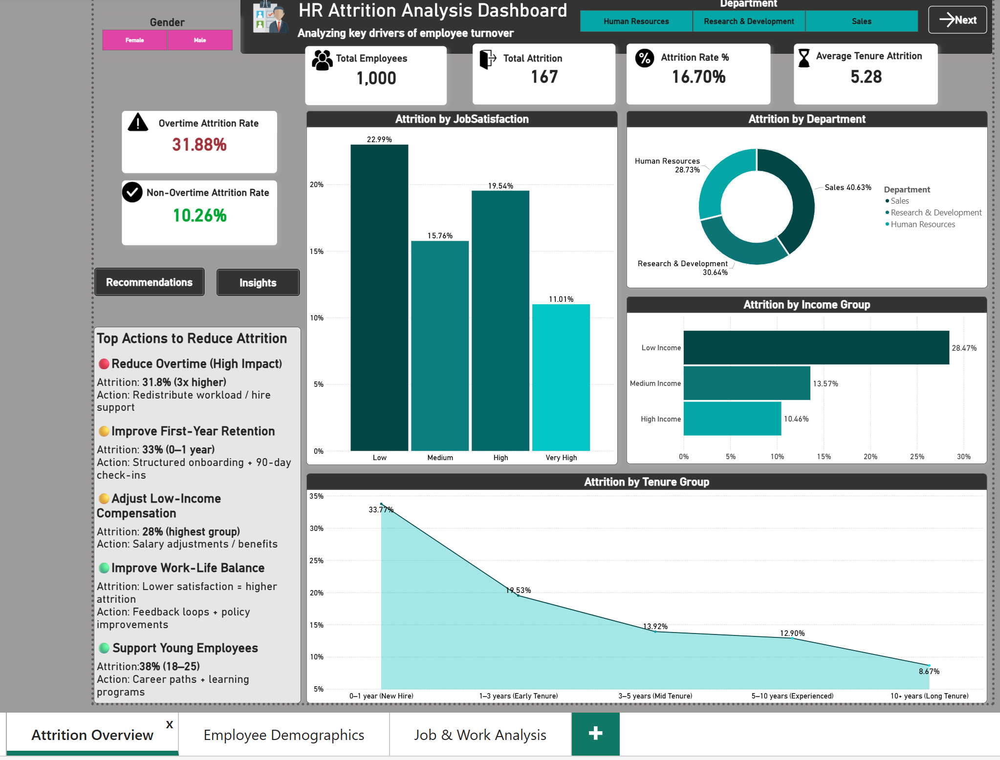
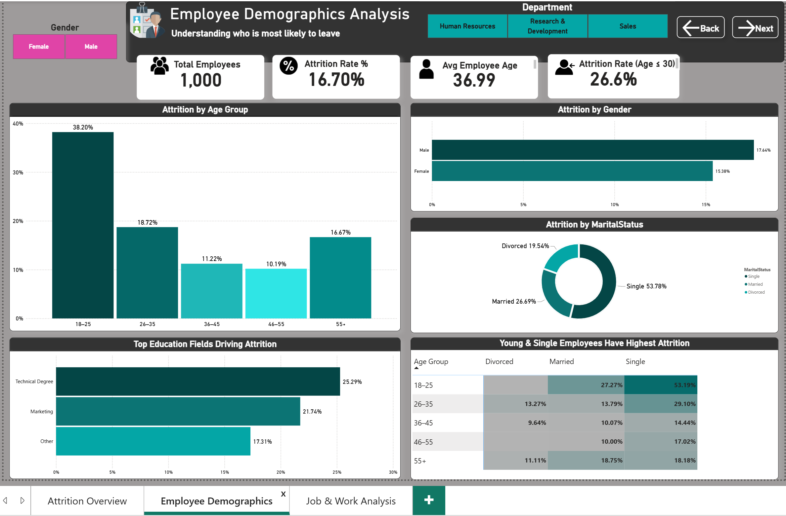
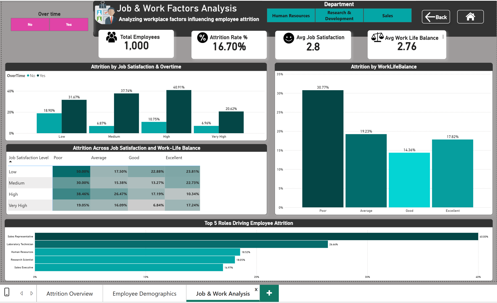

# HR Attrition Analysis | Power BI

## 📊 Project Overview

The **HR Attrition Analysis Dashboard** is an interactive Power BI project designed to analyze employee attrition and identify workforce patterns associated with employee turnover.

The dashboard provides insights into attrition across employee demographics, departments, job roles, income groups, job satisfaction, overtime, work-life balance, and employee tenure.

This project demonstrates the application of data preparation, DAX measures, a single-table analytical model, and interactive data visualization to support HR-focused business analysis.

---

## 🎯 Business Objectives

* Analyze overall employee attrition and attrition rate.
* Identify employee groups with higher attrition rates.
* Analyze attrition across departments and job roles.
* Investigate differences in attrition between employees who work overtime and those who do not.
* Analyze how attrition varies across job satisfaction levels.
* Examine attrition patterns across age, gender, marital status, and education.
* Investigate attrition across income groups and employee tenure.
* Identify workforce segments that may require further HR investigation.

---

## 🛠️ Tools & Technologies

* **Microsoft Power BI Desktop**
* **Power Query** — Data preparation and transformation
* **DAX** — Measures and business calculations
* **Data Modeling** — Single-table analytical model with a dedicated measures table
* **Data Visualization** — Interactive charts, KPIs, and dashboards
* **Microsoft Excel** — Dataset format

---

## 📁 Dashboard Pages

### 1. Attrition Overview

Provides a high-level summary of employee attrition and key workforce patterns.

**Key Components:**

* Total Employees
* Total Attrition
* Attrition Rate %
* Average Tenure of Employees Who Left
* Overtime Attrition Rate
* Non-Overtime Attrition Rate
* Attrition by Job Satisfaction
* Attrition by Department
* Attrition by Income Group
* Attrition by Tenure Group
* Key Insights and Recommendations

### 2. Employee Demographics

Focuses on demographic characteristics associated with employee attrition.

**Key Components:**

* Total Employees
* Attrition Rate %
* Average Employee Age
* Attrition Rate for Employees Age 30 or Below
* Attrition by Age Group
* Attrition by Gender
* Attrition by Marital Status
* Attrition by Education Field
* Attrition by Age and Marital Status

### 3. Job & Work Factors Analysis

Analyzes workplace factors associated with employee attrition.

**Key Components:**

* Total Employees
* Attrition Rate %
* Average Job Satisfaction
* Average Work-Life Balance
* Attrition by Job Satisfaction & Overtime
* Attrition by Work-Life Balance
* Attrition Across Job Satisfaction and Work-Life Balance
* Top Roles by Attrition Rate
* Overtime Analysis

---

## 🔄 Data Preparation & Modeling

The dataset was investigated and prepared using Power Query and Power BI.

### Data Preparation

* Investigated the dataset structure and column types.
* Performed data profiling to review valid, error, and empty values.
* Reviewed distinct values and data distributions.
* Checked data quality across the available employee attributes.
* Standardized and replaced values where required.
* Removed unnecessary columns.
* Reordered columns to improve dataset organization.
* Validated the transformed dataset before building the report.

### Data Modeling

* Used a single employee-level table as the primary analytical table.
* Created a dedicated measures table to organize DAX calculations separately from the source employee data.
* Developed analytical measures for employee attrition and workforce metrics.
* Organized measures in a centralized location for easier report maintenance.
* Used the single-table structure to support filtering and analysis across dashboard visuals.

---

## 📈 Key Business Insights

The dashboard highlights several areas for further HR investigation:

### Overtime & Attrition

Employees who work overtime have a substantially higher attrition rate than employees who do not work overtime in this dataset.

### Job Satisfaction

Attrition varies across job satisfaction levels, with lower satisfaction levels generally showing higher attrition rates in the analyzed segments.

### Employee Age

Younger employees, particularly those in the **18–25 age group**, show higher attrition compared with older employee groups in this dataset.

### Income Groups

Attrition varies across income groups, with the lower-income group showing the highest attrition rate among the analyzed income groups.

### Employee Tenure

Employees in the early stages of employment show higher attrition rates compared with employees with longer tenure.

### Job Roles

Attrition rates vary considerably across job roles, allowing HR teams to identify roles that may require additional investigation.

> These findings are descriptive patterns observed in the dataset and do not establish that any individual factor directly causes employee attrition.

---

## ⚠️ Data Quality & Limitations

The analysis is based on a portfolio dataset and therefore has limitations:

* The dataset represents a fixed sample of employees rather than a live organizational workforce.
* Observed relationships describe patterns in the dataset and should not be interpreted as causal relationships.
* The dataset does not contain all organizational factors that may influence employee attrition.
* Additional organizational information would be required to validate the findings and support real-world HR decisions.
* Attrition patterns may vary across organizations, industries, locations, and time periods.

---

## 📌 Skills Demonstrated

* Data Cleaning & Transformation
* Data Profiling
* Exploratory Data Analysis
* Single-Table Data Modeling
* DAX Measures
* KPI Development
* HR Analytics
* Attrition Analysis
* Demographic Analysis
* Workforce Analysis
* Data Visualization
* Business Insight Communication

---

## 📷 Project Preview

### Attrition Overview

### Employee Demographics

### Job & Work Factors Analysis

---

## 📂 Dataset

The dataset used in this project is a dummy **HR employee attrition dataset** downloaded from an online source and is used for portfolio and demonstration purposes. It does not represent the workforce or employee information of a real company.

The analysis, data preparation, DAX measures, and visualizations were developed as part of this portfolio project.

---

## 📥 Project Files

- **[Power BI Report (.pbix)](HR-Attrition-Analysis.pbix)** — Download and open with Power BI Desktop to explore the complete interactive report, Power Query transformations, DAX measures, and dashboard pages.
- **[Dataset (.xlsx)](data/HR-Attrition-Dataset.xlsx)** — Download the dataset used for the analysis.

## 👤 Author

**Zain Rehman**

Aspiring Data Analyst | Power BI | SQL | Data Analytics
